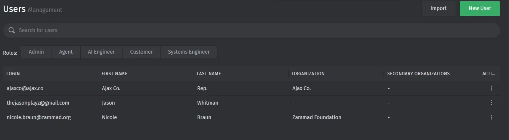
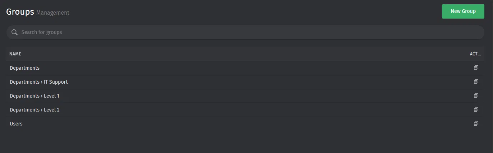
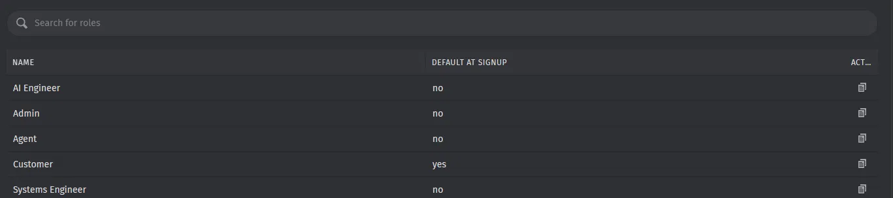
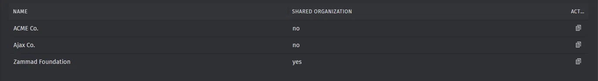
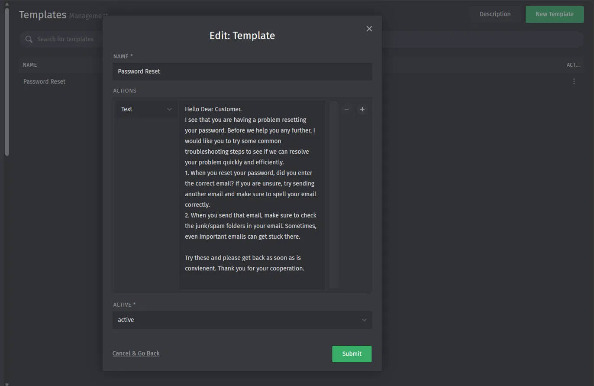
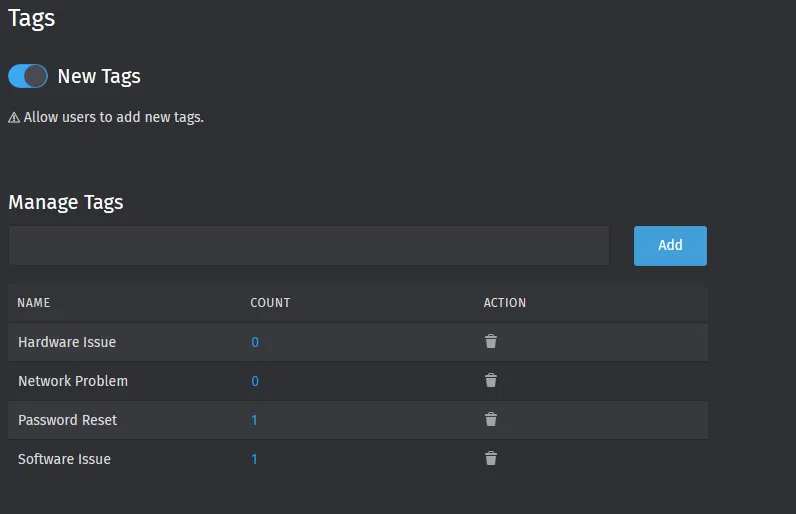
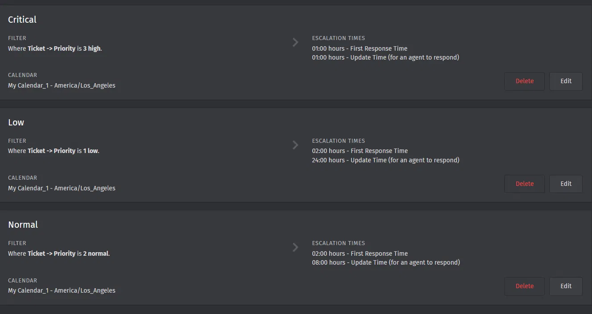
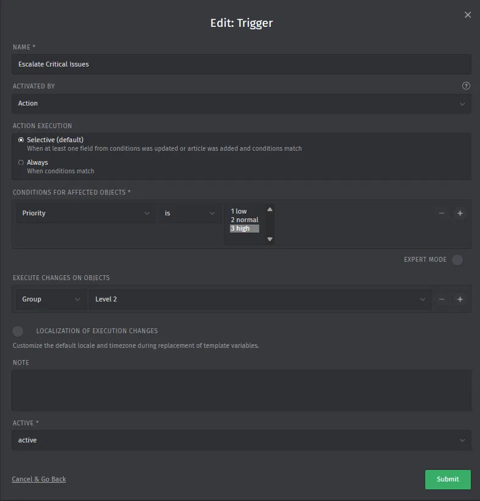

# Zammad Helpdesk Deployment

## Summary
A self-hosted example Zammad helpdesk system configured with roles, organizational groups, SLA escalation policies, and templates.

## Objective
Built to gain hands-on experience with ITSM ticketing workflows: roles, SLAs, automation rules, and other common tasks that come with real help desk tooling. It's hard to gain that kind of exposure
without already working the job, so I used previous expertise and knowledge about containerized deployment and reverse proxy configuration to stand up a Docker stack to help learn on my own terms. The challenge is often not
just putting up the stack, but when integrations with many services fail, finding the break lines, and fixing them. 

## Environment / Tech Stack
- Host: Windows 11. Ryzen 5 3600X, AMD RX 590, 32GB DDR4 @2667Mhz RAM. VMWare Workstation 
- Container: Using Docker *within* the VMWare Workstation VM to deploy a containerized stack for Zammad along with a Python script to easily manage other Docker containers I use.
- Networking: To access the Docker stack, I use a Cloudflare Tunnel setup to access the local Docker network from anywhere I am. The docker stack also has an NGINX reverse proxy to handle requests to multiple services that integrate with Zammad.

## What I Built
1. **User & Role Management:** Created custom roles beyond Zammad's defaults for organization and access controls, with a basic Customer role as default when signing up for self-service ticket submission.
2. **Organizational Structure:** Set up multiple organizations so users can be grouped and tickets can be filtered by company, organization, and roles from organizations.
3. **Group Structure:** Built a nested group organization system under 'Departments' for organizing support agent levels, with a separate 'Users' group for standard users.
4. **Canned Response Templates:** Create reusable agent response templates (E.g. Password Reset Troubleshooting template) to standardize common responses and increase efficiency. 
5. **Tagging System:**  Configured a tag taxonomy with user-generated tags enabled for further granular control for ticket categorization, reporting, and filtering.
6. **SLA Policies:** Defined three SLA tiers (Critical, Normal, Low) with escalation times tied to ticket priority. 
7. **Automated Escalation Trigger:** Built a trigger that automatically reassigns any ticket set to Critical priority to the Level 2 support group, so that critical issues reach senior staff with more expertise.

## Problems I Solved
### CSRF Token Problems
- **Issue:** I could not log into the Zammad instance through NGINX, as it was giving a 'Security token verification failed' error.
- **Diagnosis:** Cleared cookies then performed a hard reload of the website, and it did not fix it. It worked once before as well, which was confusing, so I traced how Cloudflare Tunnel was handling the traffic. Zammad received HTTP traffic internally while the URL is HTTPS, which caused Zammad to think there was a cross-site attack and activated CSRF protection. 
- **Fix:** Enabled HTTPS on the NGINX and actual Zammad instance while keeping Cloudflare Tunnel to contact it with 'https' 
### Deleting an Accidental organization
- **Issue:** While setting up the example Zammad organizations, I created one I did not mean to. I could not delete it either
- **Diagnosis:** Because of how Zammad is structured, Organizations are linked to many different types of objects. The developers made Zammad extremely cautious of deleting organizations because of that danger.
- **Fix:** I read through the administrative documentation for Zammad and figured out where the REST API endpoint was for getting and deleting organizations. I used CURL then to delete the organization and remake it through the website's UI. 

## Skills Demonstrated
Zammad Administration · Role-Based Access Control (RBAC) · Ticket Routing & Escalation · 
SLA Policy Design · Business Process Automation (Triggers) · Organizational Data Modeling · 
Canned Response / Knowledge Base Creation · IT Service Management (ITSM) Fundamentals · 
NGINX Reverse Proxy Configuration · Cloudflare Tunnel · REST API Usage (cURL) · SSL/TLS Configuration

## What's Next
- Integrate with Active Directory for authentication
- Set up an email server and integrate for an email-to-ticket pipeline

## Screenshots
[You already have these — Users, Groups, Roles, Organizations, Templates, Tags, SLA policies, Trigger config]
- 
- 
- 
- 
- 
- 
- 
- 